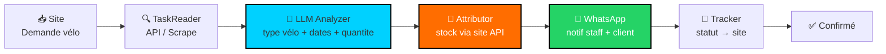

<p align="center">
  
  
  
  
</p>

<h1 align="center">RepairFlow — Agent Location Vélo</h1>

<p align="center">
  <em>« Client demande vélo → Mon site l'attribue → WhatsApp gère »</em><br/>
  <strong>Lecture → Attribution → WhatsApp — 100% traçable, 0% oublié</strong>
</p>

> ⚠️ Agent pour ton site de location vélo. Lit les demandes clients, attribue le stock via le même site, puis gère le suivi WhatsApp.

---

## 🗺️ Flux — Flèches



```
📥 Demande vélo site (LOC-xxx)
  → 🔍 TaskReader (poll /rentals ou webhook)
  → 🧠 LLM (velo_electrique/vtt/classique + urgence)
  → 👤 Attributor (POST /rentals/{id}/assign → stock)
  → 💬 WhatsApp (staff + client)
  → 🔄 Tracker (statut ↔ site ↔ WhatsApp)
```

---

## 📦 Structure (même méthode CyberAI)

```
repair-agent/
├── agent/
│   ├── task_reader.py      → lit tâches depuis ton site
│   ├── attributor.py       → attribue via API site
│   ├── whatsapp.py         → envoi/suivi WhatsApp
│   ├── llm_analyzer.py     → LLM + fallback déterministe
│   └── orchestrator.py     → 📁 → 🔍 → 🧠 → 👤 → 💬 → 🔄
├── config/
│   └── config.yaml         → URL site, tokens, mappings
├── assets/                 → banner, demo
└── tests/
```

**Principes (identique UniversalAgent) :**
- Isolation — chaque module testable seul
- LLM propose → déterministe dispose (pas d'attribution sans validation API)
- Traçabilité — chaque action loggée + écrite sur le site

---

## 🚀 Quickstart

```bash
git clone <repo> && cd repair-agent
pip install -r requirements.txt
cp config/config.example.yaml config/config.yaml  # renseigne URL site + tokens

# 1 tâche
PYTHONPATH=. python3 -m agent.orchestrator --once

# continu
PYTHONPATH=. python3 -m agent.orchestrator --loop

# API granulaire
PYTHONPATH=. python3 -m agent.task_reader --list
PYTHONPATH=. python3 -m agent.attributor --dry-run
PYTHONPATH=. python3 -m agent.whatsapp --test +213XXXXXXXX
```

---

## ⚙️ Config

```yaml
site:
  base_url: "https://ton-site.com/api"
  token: "env:SITE_TOKEN"
  endpoints:
    list: "/repairs?status=pending"
    assign: "/repairs/{id}/assign"
    status: "/repairs/{id}/status"

whatsapp:
  provider: "twilio" # ou whatsapp-business / baileys
  token: "env:WHATSAPP_TOKEN"
  templates:
    assign: "Nouvelle tâche #{id} : {type} à {adresse}"
    client: "Votre réparation #{id} est prise en charge par {tech}"
```

---

## 📊 Exemples — Vélo

| Demande client | → Attribution stock | → WhatsApp |
|---|---|---|
| 2 vélos électriques Alger 18-20 sept | → `stock_ebike_1` | `💬 Staff: nouvelle loc + client confirmé` |
| VTT Oran 1 jour | → `stock_vtt_1` | `💬 Devis auto + suivi` |
| 4 vélos classiques famille Constantine | → `stock_velo_1` | `💬 Famille notifiée` |

---

<p align="center"><strong>Malek Boucetta</strong> — même méthode que CyberAI, appliquée au terrain.</p>
