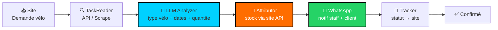

<p align="center">
  
  
  
  
  
</p>

<h1 align="center">Agent Bike — Location & Réparation Vélo</h1>

<p align="center">
  <em>« Client demande vélo → Mon site l'attribue → WhatsApp gère »</em><br/>
  <strong>Agent Bike • Location & Réparation à domicile • Cargo Aubervilliers → Paris • 100% traçable</strong>
</p>

> ⚠️ **Agent Bike** pour **labes.pro** et tout site location/réparation vélo. Lit les demandes, attribue via ton site, gère WhatsApp + carte + prix fixe.

---

## 🗺️ Flux — Flèches



```
📥 Demande vélo site (LOC-xxx)
  → 🔍 TaskReader (poll /rentals ou webhook)
  → 🧠 LLM (velo_electrique/vtt/classique + urgence)
  → 👤 Attributor (POST /rentals/{id}/assign → stock)
  → 💬 WhatsApp (staff + client)
  → 🔄 Tracker (statut ↔ site ↔ WhatsApp)
```

---

## 📦 Structure (même méthode CyberAI)

```
Agent-repair/
├── agent/
│   ├── task_reader.py      → labes.pro /api.php?action=orders_pending
│   ├── llm_chat.py         → ChatGPT → Claude → Ollama local → heuristique
│   ├── llm_local.py        → Ollama http://localhost:11434 (mistral/llama3.1) 100% local
│   ├── llm_analyzer.py     → wrapper
│   ├── pieces.py           → stock Aubervilliers, urgent, prix pièce
│   ├── weather.py          → Open-Meteo → difficulté météo cargo
│   ├── price_estimator.py  → 15€/30€/50€ FIXE labes.pro + garantie
│   ├── geo.py              → Nominatim Paris + haversine + carte Leaflet
│   ├── attributor.py       → stock via API site (round_robin)
│   ├── whatsapp.py         → Twilio / Baileys
│   ├── client_chat.py      → répond clients + suivi WhatsApp
│   ├── dashboard.py        → FastAPI /dashboard + /api/tasks + map
│   ├── webhook.py          → /webhook/repair + /webhook/whatsapp
│   └── orchestrator.py     → 📁 → 🔍 → 🧠 → 👤 → 💬 → 🔄
├── config/
│   └── config.yaml         → labes.pro, tokens, mécanos
├── assets/                 → map.html, banner
└── tests/
```

**Principes (identique UniversalAgent) :**
- Isolation — chaque module testable seul
- LLM propose → déterministe dispose (pas d'attribution sans validation API)
- Traçabilité — chaque action loggée + écrite sur le site

---

## 🚀 Quickstart

```bash
git clone https://github.com/malekboucetta656-creator/Agent-repair.git
cd Agent-repair
pip install -r requirements.txt
cp config/config.example.yaml config/config.yaml  # renseigne labes.pro + tokens

# 1 — Sans LLM (heuristique direct)
PYTHONPATH=. python3 -m agent.orchestrator --once

# 2 — Avec LLM cloud (optionnel)
export OPENAI_API_KEY=sk-...  # ou ANTHROPIC_API_KEY
PYTHONPATH=. python3 -m agent.orchestrator --once  # → ChatGPT/Claude

# 3 — Avec LLM local 100% privé (recommandé RGPD)
curl -fsSL https://ollama.com/install.sh | sh
ollama pull mistral  # ou llama3.1:8b
ollama serve &
PYTHONPATH=. python3 -m agent.orchestrator --once  # → Ollama → heuristique si off

# continu + dashboard
PYTHONPATH=. python3 -m agent.orchestrator --loop
PYTHONPATH=. uvicorn agent.dashboard:app --host 0.0.0.0 --port 8000  # → http://localhost:8000/dashboard
PYTHONPATH=. uvicorn agent.webhook:app --host 0.0.0.0 --port 8000

# API granulaire
PYTHONPATH=. python3 -m agent.task_reader --list
PYTHONPATH=. python3 -m agent.client_chat  # test réponse client
PYTHONPATH=. python3 -m agent.llm_local    # test Ollama dispo
```

---

## ⚙️ Config — Labes.pro + LLM local

```yaml
site:
  base_url: "https://labes.pro"
  endpoints:
    list: "/api.php?action=orders_pending"

llm:
  provider: "auto"  # ChatGPT → Claude → Ollama local → heuristique
  openai_key: "env:OPENAI_API_KEY"     # optionnel
  claude_key: "env:ANTHROPIC_API_KEY"   # optionnel
  # local sans clé :
  # ollama_url: "http://localhost:11434"
  # ollama_model: "mistral"  # llama3.1:8b

whatsapp:
  provider: "twilio"  # ou baileys
  business_number: "env:WHATSAPP_BUSINESS_NUMBER"
```

---

## 📊 Exemples — Labes.pro Paris Cargo

| Demande | → Analyse | → Attribution | → Prix fixe |
|---|---|---|---|
| Crevaison Paris 18 | `facile 4.26km météo OK leger` | `Malek_Aubervilliers` | `15€ MO FIXE + 8€ pièce` |
| VAE Bosch Paris 04 | `difficile 6.83km` | `Malek_Aubervilliers` | `50€ MO FIXE` |
| Transmission Paris 13 | `moyen 9.23km` | `Yacine_Pantin` | `30€ MO FIXE + 25€ pièce` |

**Garantie :** `Prix main-d'œuvre FIXE — ne bougera jamais` (pièces en sus, devis sur place)

---

<p align="center"><strong>Malek Boucetta</strong> — même méthode que CyberAI, appliquée au terrain.</p>
